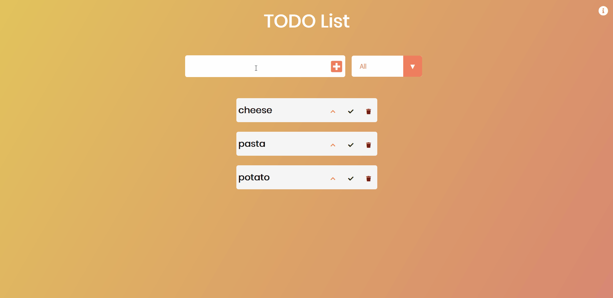

# Todo
A todo list application as every beginner does.

You can add , delete and mark item as completed, filter on completion status.
You can also increase priority using single click or set as top priority using double click.

https://gauravc4.github.io/miniatures-todo/

## Installation
To run locally, just clone repo and run index.html

## Demo

## Credits
Event though I am not a beginner, i started web dev using frameworks.
This is my first project which uses bare bones HTML, CSS, JS ... no libs or frameworks.
I have done this as first project in Creative JS Course by DevEd.
https://developedbyed.com/

## Foot Note
This is a part of collection of small features that I enjoyed making with html css and js.

See all of them here : https://gauravc4.github.io/miniatures-gallery/
